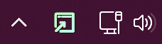

<div align="center">
  
  
  <h1>Browser Picker</h1>
  
  <p align="center">A windows process that automatically routes links to the correct browser</p>

  <p align="center">
    <a style="text-decoration:none" href="https://github.com/Joshua-Beatty/Browser-Picker/releases">
      </a>
    <a style="text-decoration:none" href="#" style="cursor: none">
      </a>
    <a style="text-decoration:none" href ="./LICENSE" >
      
    </a>
  </p>
</div>

This is A Tauri application which opens up a menu to let a user pick which browser to open a link in. It will default to the default browser unless once of the other browsers is open, at which point it will ask the user to choose.

## Demo
This demo shows opening an unmatched link with no browsers open, so defaulting to the default browser.

Then the second link is matched to chrome so it opens in chrome.

Then another unmatched link, but now chrome is open, so it asks the user to chose the browser to load into.
[](https://www.youtube.com/watch?v=m6kakXuEpTA)

Browser Picker also features a tray icon for easy opening:

[](https://www.youtube.com/watch?v=m6kakXuEpTA)

## Install
Download the msi in releases and install Browser Picker.

Then go into windows settings and choose Browser Picker as your default browser. 

## Settings
The settings should be in the following format:
```json
{
  "browsers": [
    {
      "default": true,
      "path": "C:\\Program Files\\Mozilla Firefox\\firefox.exe",
      "icon": "https://upload.wikimedia.org/wikipedia/commons/thumb/a/a0/Firefox_logo%2C_2019.svg/1971px-Firefox_logo%2C_2019.svg.png",
      "name": "firefox",
      "home": "about:home"
    },
    {
      "path": "C:\\Program Files (x86)\\Google\\Chrome\\Application\\chrome.exe",
      "icon": "https://upload.wikimedia.org/wikipedia/commons/thumb/e/e1/Google_Chrome_icon_%28February_2022%29.svg/480px-Google_Chrome_icon_%28February_2022%29.svg.png",
      "name": "chrome",
      "home": "https://google.com",
      "matches": [
        ".+twitter.+"
      ]
    }
  ]
}
```
Default (Optional) specifies that this browser will be opened if the others are not running, have only one marked as default., if left undefined, defaults to false. 

Path is the executable of the browser to launch

Icon is a link to an icon to display. 

Home is the default home page to open if coming from browser picker directly and not a link event. 

Name (Optional) is the process name to search for when trying to decide if a non default browser is open and if the user should be prompted to chose a browser.

Matches (Optional) is an array of regular expressions, that are tested against the URL, if any of them match that browser is used to open the link, this is checked before the default browser check.


## Development
Clone this repo then run the following commands:
```bash
npm install
npm run tauri dev
```

#### Recommended IDE Setup

- [VS Code](https://code.visualstudio.com/) + [Tauri](https://marketplace.visualstudio.com/items?itemName=tauri-apps.tauri-vscode) + [rust-analyzer](https://marketplace.visualstudio.com/items?itemName=rust-lang.rust-analyzer)

## Notice

Icons in this application come from [iconoir](https://github.com/iconoir-icons/iconoir/blob/main/LICENSE), [heroicons](https://github.com/iconoir-icons/iconoir/blob/main/LICENSE), and  [Feather Icons](https://github.com/feathericons/feather/blob/main/LICENSE)
